# SCHRAUSSER-MAT
## Mathematical-statistical algorithm interpreter.

SCHRAUSSER-MAT philosophy and vision is to create and, above all, to maintain an optimally relevant and powerful tool for data analysis in the purely scientific and technical area as at universities and research institutes.
The MAT System is divided into
1) General mathematical functions, trigonometric functions and statistics
2) Linear regression and matrix calculation
3) Distribution functions
4) Probability and combinatorics
5) Randomization and data simulation models

and should contain the full range of functions corresponding to the always contemporal level of knowledge and development. This is achieved by the fact that, under the supervision of the originator to preserve the concept logic, SCHRAUSSER-MAT is open to anyone in order to expand the functions within the framework of the basic definition. This vision and approach should be retained in the long term and passed on to successors, keeping the concept original and unadulterated:
So,
no overgrowth of the system structure as the basic concept in design, ergonomics and functional definition is retained
and
it is yet permanently expandable with functions as part of the system philosophy.

Non-profit oriented and therefore freely available for everyone to use.

Dietmar Schrausser

Methods: Exact Methods, Bootstrapping, Linear Regression, Probability Distributions, Permutation Tests, Mathematical Statistics, Asymptotic Statistics, Combinatorics, Functions, Simulation Modeling

### Screenshots

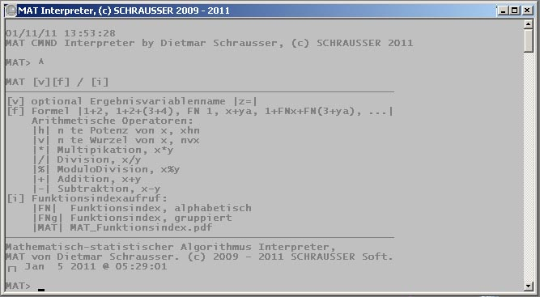

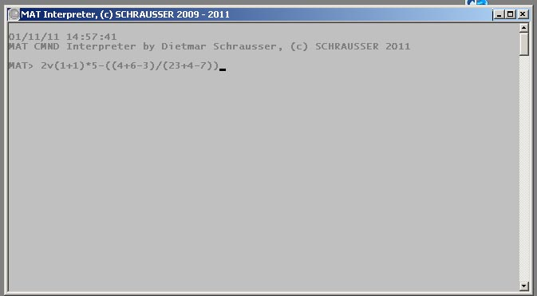

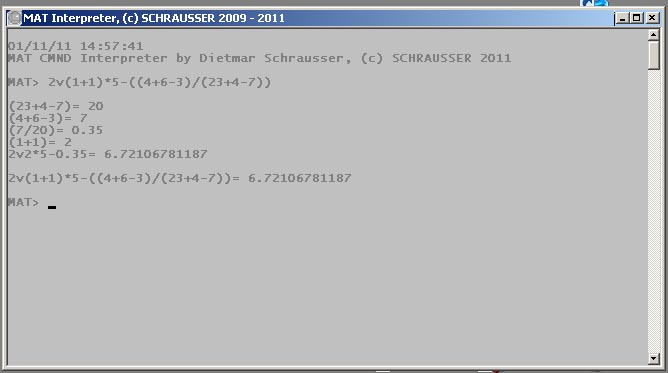

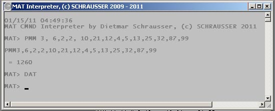

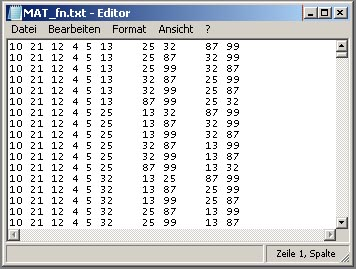

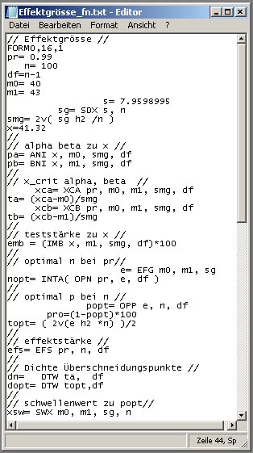

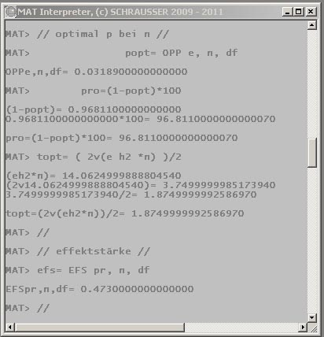

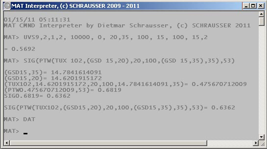

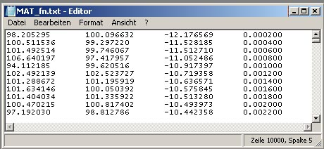

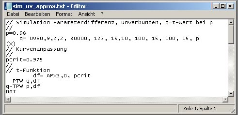

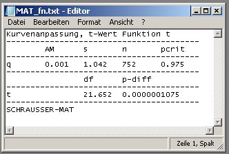

## References

Schrausser, D. G. (2022). SCHRAUSSER-MAT. *Code*. ResearchGate.
https://doi.org/10.13140/RG.2.2.14377.26727.RG.2.2.16344.57600/1.

Schrausser, D. G. (2022). Mathematical-Statistical Algorithm Interpreter,
SCHRAUSSER-MAT: Function Index, Manual. *Handbooks*. Academia.
https://doi.org/doi.org/10.13140/RG.2.2.28314.52164.

Schrausser, D. G. (2023). *Schrausser/SCR-CLR7r: SCHRAUSSER-MAT SCR: CLR7r* (version
v1.0.0). Zenodo. https://doi.org/10.5281/zenodo.7647758.
